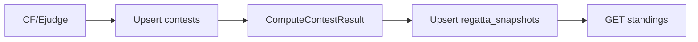

# План 1: Pipeline просчёта и snapshot регатты

**Зависимости:** нет.  
**Связанный план:** [02-contestr-realtime-integration.plan.md](02-contestr-realtime-integration.plan.md) (push-уведомления — после этого плана).

## Аудит текущего состояния (2025-06)

| Область | Сейчас | После плана |
|--------|--------|-------------|
| GET `/api/regatta/contests/{id}` | [`GetContestResult`](../../contestr/internal/services/regatta/contest_result.go) — полный пересчёт на каждый запрос | Чтение `regatta_snapshots` |
| Фоновый цикл | [`ContestSyncService`](../../contestr/internal/services/contest_sync/contest_sync.go) — только `adapter.FetchContest` → `contests` | sync + compute + snapshot |
| Admin refresh | [`syncService.SyncContest`](../../contestr/internal/services/contest_admin/service.go) — только sync | `pipeline.RunContest` |
| Mongo коллекция | `contests`, `tours`, … | + `regatta_snapshots` |
| Конфиг interval | [`config.yaml`](../../contestr/configs/config.yaml): **`15s`** (не 1m) | тот же ключ `contest_sync.interval` |
| Фронт poll | [`useContestStandings`](../../contestr-front/src/features/contest/hooks/useContestStandings.ts): **5s** | можно оставить 5s или поднять до interval |
| `current_time` в standings | `time.Now()` при каждом compute | заморожен на `computed_at` (фронт standings не использует поле) |

**Ничего из плана 1 ещё не реализовано** — все todo `pending`.

## Цель

Убрать пересчёт standings/events на каждый HTTP-запрос. Один фоновый цикл по **`contest_sync.interval`** (сейчас 15s в dev, в проде можно поставить 1m):

1. Загрузка с CF/Ejudge → `contests` (raw submissions).
2. Просчёт regatta (`CalculateResultWithSettingsAt`, `BuildContestEventsAt`).
3. Сохранение в **`regatta_snapshots`**.
4. API отдаёт готовый snapshot.



## Модель данных

Коллекция Mongo: **`regatta_snapshots`**, уникальный ключ `contest_id`.

```go
// contestr/internal/repository/regatta_snapshot.go
type RegattaSnapshot struct {
    ContestID  int                       `bson:"contest_id"`
    ComputedAt time.Time                 `bson:"computed_at"`
    Standings  regatta.ContestStandings  `bson:"standings"`
}
```

```go
type RegattaSnapshotRepository interface {
    GetByContestID(ctx context.Context, contestID int) (*RegattaSnapshot, error)
    Upsert(ctx context.Context, snapshot *RegattaSnapshot) error
    DeleteByContestID(ctx context.Context, contestID int) error
}
```

- Одна метка **`ComputedAt`** на успешный проход pipeline (шаги 2+3).
- В `standings` сохраняется полный [`ContestStandings`](../../contestr/pkg/regatta/standings.go): `rows`, `events`, `current_tour_*`, `is_pause_break`, `contest_start_time`, **`current_time`** (= момент compute, не live clock).
- **Без** `PublishedEventKeys` — diff для push будет в [плане 2](02-contestr-realtime-integration.plan.md).

### Индекс

При создании репозитория — `contest_id` unique (или полагаться на upsert filter; unique index предпочтительнее).

## Шаг 1 — `ComputeContestResult` (рефакторинг без изменения формул)

**Файл:** [`contest_result.go`](../../contestr/internal/services/regatta/contest_result.go)

1. Переименовать тело `GetContestResult` → `ComputeContestResult` (exported — нужен pipeline и тестам).
2. Логика **буквально та же**: tours, runs, `currentElapsedSeconds := max(0, int(time.Since(contest.StartTime).Seconds()))`, сортировка rows, `BuildContestEventsAt`.
3. `GetContestResult` **удалить** или оставить deprecated-обёртку только для переходного периода — в финале handler её не вызывает.

```go
func (s *Regatta) ComputeContestResult(ctx context.Context, contestID int) (regatta.ContestStandings, error)
```

**Тест (рекомендуется):** golden/snapshot-тест на фиксированных tours+runs+`now` — убедиться, что рефакторинг ничего не сломал. Можно опереться на существующие кейсы в [`tour_result_test.go`](../../contestr/internal/services/regatta/tour_result_test.go).

## Шаг 2 — `RegattaSnapshotRepository`

**Новый файл:** `contestr/internal/repository/regatta_snapshot.go`

Паттерн как [`contest.go`](../../contestr/internal/repository/contest.go):

- `Upsert`: filter `{"contest_id": id}`, `$set` всего документа.
- `GetByContestID`: `FindOne` → `mongo.ErrNoDocuments` если нет.
- `DeleteByContestID`: для [`DeleteContest`](../../contestr/internal/services/contest_admin/service.go).

Wire в [`wire.go`](../../contestr/cmd/app/wiresets/wire.go): `NewMongoRegattaSnapshotRepository`.

## Шаг 3 — `RegattaPipelineService`

**Новый пакет:** `contestr/internal/services/regatta_pipeline/`

```go
type RegattaPipelineService struct {
    syncService  *contest_sync.ContestSyncService // reuse SyncContest + gating
    regatta      *regatta.Regatta
    snapshotRepo repository.RegattaSnapshotRepository
    syncInterval time.Duration // для RunPeriodic — делегировать gating в sync
}
```

### `RunContest(ctx, contestID) error`

| Шаг | Действие | При ошибке |
|-----|----------|------------|
| 1 | `syncService.SyncContest(ctx, contestID)` | **return** — snapshot **не трогаем** |
| 2 | `regatta.ComputeContestResult(ctx, contestID)` | log error, **return** — старый snapshot остаётся |
| 3 | `snapshotRepo.Upsert` с `ComputedAt: time.Now().UTC()` | log error, return |

### `RunPeriodic(ctx) *SyncResult`

Скопировать структуру [`SyncPeriodic`](../../contestr/internal/services/contest_sync/contest_sync.go): тот же обход registry, тот же `shouldSyncPeriodic` gating (CF phase, `interval_before_start`), но вместо `SyncContest` вызывать `RunContest`.

**Вариант реализации gating:** вынести `shouldSyncPeriodic` + обход registry в pipeline, вызывая `syncService.SyncContest` только внутри `RunContest` — дублирования логики sync не нужно.

### `Start(ctx) error`

Заменить тело goroutine в [`main.go`](../../contestr/cmd/app/main.go):

```go
// было: contestSync.Start(ctx)
pipeline.Start(ctx) // первый RunPeriodic сразу, потом ticker
```

`ContestSyncService.Start` можно удалить или оставить как thin wrapper → `pipeline.Start` (не запускать оба).

## Шаг 4 — Подключить триггеры

Заменить прямые вызовы `syncService.SyncContest` на `pipeline.RunContest` в [`contest_admin/service.go`](../../contestr/internal/services/contest_admin/service.go):

| Метод | Сейчас | Станет |
|-------|--------|--------|
| `RegisterCodeforcesContest` | sync | `RunContest` |
| `UpdateContestSettings` | sync | `RunContest` |
| `RefreshContest` | sync | `RunContest` |
| `UpsertHandles` / `DeleteHandle` | sync | `RunContest` |
| `DeleteContest` | — | + `snapshotRepo.DeleteByContestID` |

**Не в scope плана 1 (осознанно):** `StartTour` не триггерит pipeline — standings обновятся на следующем tick (~interval). Push старта тура в плане 2 идёт отдельно. Если нужна мгновенная таблица после старта тура — отдельная задача: `RunContest` после `StartTour`.

## Шаг 5 — API

**Файл:** [`get_contest_standings.go`](../../contestr/internal/handlers/regatta/get_contest_standings.go)

```go
type RegattaStandingsReader interface {
    GetContestSnapshot(ctx context.Context, contestID int) (*repository.RegattaSnapshot, error)
}
```

Handler:

1. `snapshot, err := reader.GetContestSnapshot(...)`
2. `errors.Is(err, mongo.ErrNoDocuments)` → **404** `{ "error": "standings not ready" }` (зафиксировать в OpenAPI)
3. 200: JSON = поля из `snapshot.Standings` + **`computed_at`** (ISO-8601)

**Ответ API** — плоский объект (как сейчас + новое поле):

```json
{
  "contest_id": 123,
  "contest_name": "...",
  "rows": [...],
  "events": [...],
  "computed_at": "2025-06-22T12:00:00Z"
}
```

Реализация reader — тонкий метод на `Regatta` или отдельный `StandingsService`; не вызывать `ComputeContestResult` из handler.

### OpenAPI

[`openapi.yaml`](../../contestr/api/openapi.yaml) → `RegattaContestStandings`:

- добавить `computed_at` (string, format date-time, optional в schema но present после pipeline)
- response **404** для «snapshot ещё нет»
- перегенерировать TS client (`contestr-front`)

### Поведение до первого pipeline

| Сценарий | Сейчас | После |
|----------|--------|-------|
| Контест зарегистрирован, sync прошёл, GET standings | 200, compute на лету | 404 до первого `RunContest` |
| Первый tick / admin Refresh | sync only | sync + snapshot → 200 |

**Смягчение:** `main` уже вызывает `SyncPeriodic` сразу при старте — первый `RunPeriodic` создаст snapshots за секунды после деплоя. Admin Register/Refresh тоже прогоняют полный pipeline.

### Изменение контракта для фронта

- [`useContestStandings`](../../contestr-front/src/features/contest/hooks/useContestStandings.ts): обработать 404 (показать «данные готовятся» / skeleton, не падать).
- Poll 5s — ок; данные меняются не чаще `interval`.
- `computed_at` — опционально в UI («обновлено N сек назад»).

**Events:** полный `events[]` в snapshot — лента [`ContestEventLog`](../../contestr-front/src/features/contest/components/event-log/ContestEventLog.tsx) без изменений контракта. Ключи событий для плана 2: [`regattaEventKey`](../../contestr-front/src/features/contest/components/event-log/eventLogKeys.ts).

## Wire / DI (чеклист)

```
wire.go:
  repository.NewMongoRegattaSnapshotRepository
  regatta_pipeline.NewRegattaPipelineService
  wire.Bind(regattahandlers.RegattaStandingsReader, ...)
  // ContestSyncService остаётся для SyncContest внутри pipeline
  main.go: pipeline.Start вместо contestSync.Start
  contest_admin: inject *regatta_pipeline.RegattaPipelineService
```

## Порядок внедрения (безопасный)

1. **compute-extract** — чистый рефакторинг, handler пока на `GetContestResult` / `ComputeContestResult` — поведение API не меняется.
2. **snapshot-repo** — коллекция + repo + delete в admin.
3. **pipeline-service** + unit-тесты `RunContest` (mock sync/regatta/repo).
4. **wire-pipeline** — фоновый цикл и admin → `RunContest`; **пока handler ещё compute** — можно параллельно писать snapshots для сверки.
5. **api-snapshot** — переключить handler на snapshot + 404; обновить OpenAPI и фронт.
6. **verify-pipeline** — ручная и автоматическая проверка.

Шаг 4→5 можно объединить в один PR, если сразу переключаем API.

## Проверка

| Сценарий | Ожидание |
|----------|----------|
| После `RunContest` | GET === BSON snapshot; очки с overtake/bonus |
| До первого pipeline | 404 |
| Admin Refresh | Один contest: sync + snapshot; GET 200 |
| CF solve | В ленте events после следующего tick (~interval) |
| Sync fail (CF down) | Старый snapshot на месте |
| Compute fail (нет tours в mongo) | Старый snapshot; залогировать |
| Delete contest | snapshot удалён |
| Register contest | после Register: snapshot есть (или 404 + ошибка sync в ответе admin) |

### Ручная сверка (временно)

До переключения handler — скрипт/тест: `ComputeContestResult` vs `snapshot.Standings` после pipeline на staging-контесте.

## Вне scope

- contestr-realtime, push, overlay ([план 2](02-contestr-realtime-integration.plan.md)).
- Инкрементальный пересчёт туров (TODO в `contest_result.go`).
- `RunContest` после `StartTour` (задержка = interval).
- Append-only коллекция events.
- Fallback «compute on cache miss» в GET — осознанно **нет**, чтобы гарантировать один источник правды для плана 2 diff.

## Риски и как их закрыть

| Риск | Митигация |
|------|-----------|
| 404 сразу после деплоя | `RunPeriodic` при старте; admin Refresh |
| Замороженный `current_time` | Фронт standings не читает поле; фаза/таймер — отдельный timetable API |
| Interval 15s vs 1m | Один ключ конфига; в плане не привязываться к конкретной цифре |
| Двойной запуск sync+pipeline | Один `Start` в main, не держать два ticker |
| Register возвращает success при fail pipeline | Сохранить текущую семантику: contest registered + warn/error если sync/compute fail |
