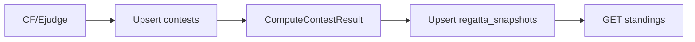

# План 1: Pipeline просчёта и snapshot регатты

**Зависимости:** нет.  
**Связанный план:** [02-contestr-realtime-integration.plan.md](02-contestr-realtime-integration.plan.md) (push-уведомления — после этого плана).

## Цель

Убрать пересчёт standings/events на каждый HTTP-запрос. Один фоновый цикл по **`contest_sync.interval: 1m`** ([`contestr/configs/config.yaml`](../../contestr/configs/config.yaml)):

1. Загрузка с CF/Ejudge → `contests` (raw submissions).
2. Просчёт regatta (`CalculateResultWithSettingsAt`, `BuildContestEventsAt`).
3. Сохранение в **`regatta_snapshots`**.
4. API отдаёт готовый snapshot.



## Модель данных

```go
type RegattaSnapshot struct {
    ContestID  int
    ComputedAt time.Time
    Standings  regatta.ContestStandings // rows + events + metadata
}
```

- Одна метка **`ComputedAt`** на успешный проход pipeline.
- **Без** `PublishedEventKeys` — diff для push будет в плане 2.

## RegattaPipelineService

[`contestr/internal/services/regatta_pipeline/`](../../contestr/internal/services/regatta_pipeline/) (или рефакторинг `contest_sync`):

| Шаг | Действие |
|-----|----------|
| 1 | `adapter.FetchContest` → `contestRepo.Upsert` |
| 2 | `ComputeContestResult(ctx, contestID)` |
| 3 | `snapshotRepo.Upsert` |

Триггеры: тикер 1m, admin `SyncContest` / refresh.

Ошибка на шаге 1 → snapshot не трогаем. Ошибка на 2–3 → лог, старый snapshot остаётся для API.

## API

[`get_contest_standings.go`](../../contestr/internal/handlers/regatta/get_contest_standings.go):

- **Было:** `GetContestResult` (compute на каждый GET).
- **Станет:** `snapshotRepo.Get(contestID)` → JSON как сейчас + поле **`computed_at`**.
- Нет snapshot: `404` или пустой ответ (зафиксировать в OpenAPI).

**Events:** полный `events[]` в snapshot — лента [`ContestEventLog`](../../contestr-front/src/features/contest/components/event-log/ContestEventLog.tsx) без изменений контракта.

## Рефакторинг Go

- `ComputeContestResult` — internal, только pipeline.
- `GetContestResult` на HTTP handler **не** вызывается (удалить или оставить alias для тестов → snapshot).
- Wire: pipeline вместо голого `ContestSyncService.Start` loop body.

## Фронт (минимально)

- Standings poll можно оставить 60s — данные обновляются раз в 1m.
- Опционально показать `computed_at` в UI.
- **Не** добавлять socket/overlay в этом плане.

## Проверка

| Сценарий | Ожидание |
|----------|----------|
| После pipeline | GET === snapshot, очки с overtake/bonus |
| До первого pipeline | 404 / пусто |
| Admin refresh | Один contest проходит pipeline |
| CF solve | В ленте events после следующего тика (~1m) |

## Вне scope

- contestr-realtime, push, overlay.
- Ускорение interval &lt; 1m.
- Append-only коллекция events.
