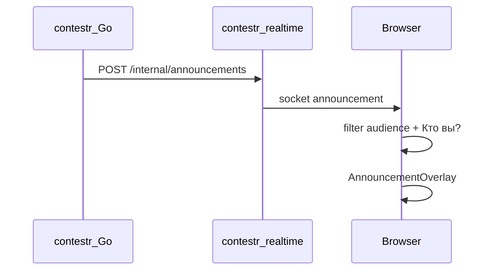

# План 2: Внедрение contestr-realtime

**Зависимости:** [План 1 — Regatta pipeline snapshots](01-regatta-pipeline-snapshots.plan.md) (snapshot + diff events на тике pipeline).

**Текущее состояние репо:**
- [`docker-compose.yaml`](../../docker-compose.yaml) — сервиса `realtime` **нет**.
- [`contestr-front`](../../contestr-front) — нет socket/announcement кода; остался [`FollowedParticipantContext`](../../contestr-front/src/features/contest/follow/FollowedParticipantContext.tsx).
- [`contestr`](../../contestr) — нет вызовов realtime.
- [`contestr-realtime`](../..) — есть `dist/` и `node_modules`, **исходники `src/` удалены** (восстановить из dist или заново).

## Цель

Server-push полноэкранных объявлений вместо poll на фронте:

| Событие | Источник | audience |
|---------|----------|----------|
| Старт тура N (вкл. тур 1) | Go `StartTour`, `!isPause` | `all` |
| +очки / overtake | Go после pipeline: diff `old snapshot.events` vs `new` | `participant` |
| Admin debug | Front `announcement:emit` + JWT | all / participant |

---

## 1. contestr-realtime (сервис)

### Восстановить пакет

- Вернуть `src/` (index, config, auth, protocol, handlers).
- Сохранить существующие socket-события из `dist/protocol.js`:
  - `contest:join`
  - `announcement:emit` (admin JWT, ack)
  - `announcement` (broadcast клиентам)

### Добавить internal API

`POST /internal/announcements`

- Header: `X-Internal-Secret` (= `APP_REALTIME_INTERNAL_SECRET`).
- Body: `{ contestId, payload: AnnouncementPayload }`.
- `io.to(contest:{id}).emit("announcement", payload)`.

`AnnouncementPayload` (string caption для socket):

- `id`, `title`, `caption`, `titleVariant` (`tour` | `points`), `confetti`, `holdMs?`
- `audience`: `all` | `participant`, `participantId?`

### Infra

- [`docker-compose.yaml`](../../docker-compose.yaml): service `realtime`, healthcheck, `depends_on` в nginx.
- [`contestr-front/nginx.conf`](../../contestr-front/nginx.conf): `location /socket.io/` → `realtime:3001`.
- [`contestr-front/vite.config.ts`](../../contestr-front/vite.config.ts): proxy `/socket.io` → `127.0.0.1:3001`.

Env (server + realtime): `APP_REALTIME_URL`, `APP_REALTIME_INTERNAL_SECRET`, `APP_ADMIN_JWT_SECRET` (для admin emit).

---

## 2. Go — publisher и хуки

### `AnnouncementPublisher`

`contestr/internal/services/announcements/publisher.go` — HTTP POST в realtime, log on error, не падать pipeline.

### Push очков (после плана 1)

В конце `RegattaPipeline.RunContest`:

1. `old := snapshotRepo.Get`
2. `new := compute`
3. `added := scoringKeys(new.Events) − scoringKeys(old.Events)` (если `old == nil` → пусто)
4. Для каждого event в `added` → build caption («за решение», «обогнав соперников») → publish participant
5. `snapshotRepo.Upsert(new)`

Ключ event: `tourIndex|type|time_sec|participant_id|problem_code|verdict` (как бывший `regattaEventKey`).

### Push тура

В `StartTour` / `tryStartPendingHead` после успеха, `!isPause`:

- `title: "Тур {round}"`, `caption: "Старт тура"`, `audience: all`, confetti false.

Не ждать pipeline 1m.

---

## 3. Frontend

Восстановить модуль `contestr-front/src/features/contest/follow/announcement/`:

| Файл | Роль |
|------|------|
| `realtimeProtocol.ts` | типы + SOCKET_EVENTS |
| `realtimeSocket.ts` | singleton `socket.io-client` |
| `useAnnouncementSocket.ts` | join room, `announcement` → enqueue |
| `AnnouncementContext.tsx` | очередь + hold timers |
| `AnnouncementOverlay.tsx` | `CelebrationOverlayFrame` + confetti |
| `useOverlayPresentation.ts` / CSS | fade in/out |
| `caption.tsx` | подсветка задачи в caption |
| `AnnouncementSocketBridge.tsx` | hook mount |
| `AnnouncementDebugBar.tsx` | опционально, admin only |

**`AnnouncementContext.enqueue`:** фильтр `shouldShowAnnouncement` — `all` всем; `participant` только если `followedParticipantId` совпадает.

**App.tsx:** `FollowedParticipantProvider` → `AnnouncementProvider` → bridge + overlay (+ debug bar).

**Не восстанавливать:** `useTourStartAnnouncementSource`, `useFollowedScoreAnnouncementSource` (poll) — push только с socket.

Зависимость: `socket.io-client` в `package.json`.

---

## 4. Порядок внедрения

1. Realtime: src + internal route + docker + proxy (можно проверить curl).
2. Go publisher + tour push (без pipeline diff).
3. План 1 pipeline (если ещё не сделан).
4. Go pipeline diff → publish.
5. Front announcement stack.
6. Admin debug bar.

---

## Проверка

| Сценарий | Ожидание |
|----------|----------|
| Старт тура | Все вкладки ~1s |
| Новый solve | ~1m: snapshot + push на вкладке с «Кто вы?» |
| Другой follow | Нет overlay |
| Admin debug «Всем» | Все вкладки |
| Realtime down | Debug fallback local enqueue (опционально) |

## Вне scope

- Push при `problem_rejected`.
- Outbox / `PublishedEventKeys` (diff snapshot достаточен).
- WebSocket внутри Go.
